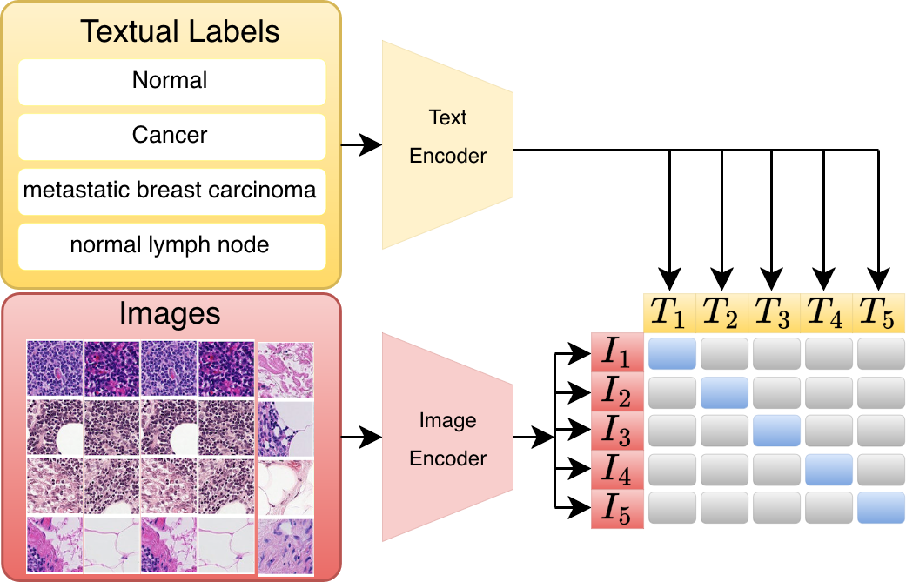
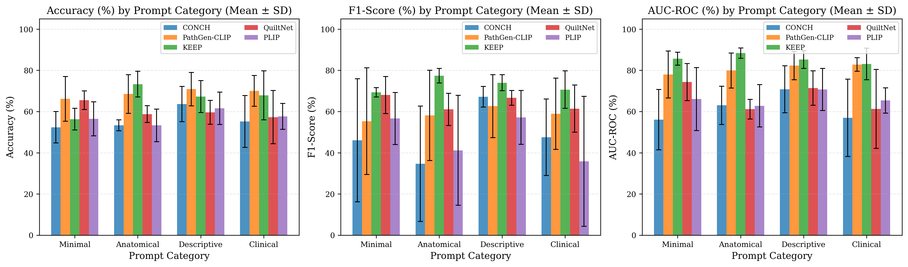
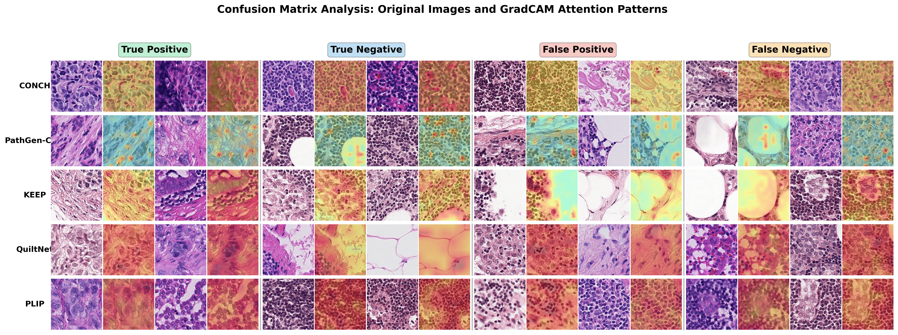

<div align="center">

# Clinical Concept Sensitivity Analysis<br/>in Pathology Vision–Language Models

**A reproducible zero-shot benchmark of five pathology-domain VLMs on PatchCamelyon,<br/>measuring how clinical prompt specificity affects zero-shot classification.**

[](./LICENSE)
[](https://www.python.org/downloads/)
[](https://pytorch.org/)
[](#models)
[](#prompt-catalogue)
[](https://github.com/basveeling/pcam)
[](https://github.com/psf/black)

<p align="center">
  
  <br/>
  <em>Figure 1. Contrastive vision–language alignment used by the benchmarked models: image and text encoders map patches and prompt labels into a shared space where matched pairs are pulled together.</em>
</p>

</div>

---

## Table of contents

- [Overview](#overview)
- [Key findings](#key-findings)
- [Models](#models)
- [Prompt catalogue](#prompt-catalogue)
- [Installation](#installation)
- [Quick start](#quick-start)
- [Reproducing the figures and tables](#reproducing-the-figures-and-tables)
- [GradCAM visualisations](#gradcam-visualisations)
- [Repository structure](#repository-structure)
- [Headline results](#headline-results)
- [Citation](#citation)
- [License](#license)
- [Acknowledgments](#acknowledgments)

---

## Overview

Pathology-domain vision–language models (VLMs) such as **CONCH**, **PathGen-CLIP**,
**KEEP**, **QuiltNet**, and **PLIP** advertise strong zero-shot transfer. In
practice, their accuracy on the same image often swings by **+20 – +30 percentage
points** depending on how the class label is phrased.

This repository provides:

1. A common `BaseVLModel` interface, with thin wrappers for the five models
   above so they can be loaded, prompted, and evaluated with the same API.
2. A prompt manager that loads **20 prompt pairs** grouped into 4 *categories*
   of increasing clinical specificity (`minimal`, `anatomical`, `descriptive`,
   `clinical`).
3. A zero-shot evaluator that computes accuracy, F1, AUC-ROC, balanced
   accuracy, sensitivity, specificity, Cohen's κ, and MCC per prompt, plus
   aggregate statistics across all prompts.
4. A GradCAM implementation that works with the diverse vision encoders used
   by the five models (CLIP-style `visual.transformer.resblocks`, `timm`
   `blocks`, and HuggingFace `vision_model.encoder.layers`).
5. Scripts to regenerate every figure and LaTeX table in the paper from
   `results/zero_shot/*_summary.txt`.

---

## Key findings

<p align="center">
  
  <br/>
  <em>Figure 2. Mean ± SD accuracy, F1-score, and AUC-ROC for CONCH, PathGen-CLIP, KEEP, QuiltNet, and PLIP across minimal, anatomical, descriptive, and clinical prompt categories on PatchCamelyon.</em>
</p>

---

## Models

| Model           | Source                                                     | Backbone     | Framework        | Notes                                                |
|-----------------|------------------------------------------------------------|--------------|------------------|------------------------------------------------------|
| **CONCH**       | [`MahmoodLab/CONCH`](https://huggingface.co/MahmoodLab/CONCH) | ViT-B/16     | `conch_open_clip`  | Gated — requires HF token                            |
| **PathGen-CLIP**| [`jamessyx/PathGen-CLIP`](https://huggingface.co/jamessyx/PathGen-CLIP) | ViT-B/16     | `open_clip`        | Local `.pt` checkpoint                               |
| **KEEP**        | [`Astaxanthin/KEEP`](https://huggingface.co/Astaxanthin/KEEP)             | Custom ViT   | `transformers`     | `trust_remote_code=True`                             |
| **QuiltNet**    | [`wisdomik/QuiltNet-B-32`](https://huggingface.co/wisdomik/QuiltNet-B-32) | ViT-B/32     | `open_clip`        | Trained on Quilt-1M                                  |
| **PLIP**        | [`vinid/plip`](https://huggingface.co/vinid/plip)                         | ViT-B/32     | `transformers`     | Standard CLIP pipeline                               |

All five wrappers expose the same surface:

```python
class BaseVLModel:
    def encode_image(self, images: Tensor) -> Tensor: ...
    def encode_text(self, texts: List[str]) -> Tensor: ...
    def zero_shot_predict(self, images, texts) -> Tuple[Tensor, Tensor]: ...
    def get_preprocessor(self): ...
    def get_attention_maps(self, images) -> Tensor: ...
```

---

## Prompt catalogue

`config/prompt_configs.yaml` defines **4 categories × 5 prompt pairs = 20 pairs**.
Each pair is ordered `[label_0, label_1]` to align with PCam labels
(`0 = normal`, `1 = tumor`).

| Category      | Style                                  | Example                                                                                            |
|---------------|----------------------------------------|----------------------------------------------------------------------------------------------------|
| `minimal`     | Single-word labels                     | `["normal", "cancer"]`                                                                             |
| `anatomical`  | + anatomical context                   | `["healthy lymph node", "metastatic lymph node"]`                                                  |
| `descriptive` | + imaging modality / staining          | `["H&E stained normal lymph node", "H&E stained lymph node with tumor"]`                           |
| `clinical`    | Clinical / pathology-report wording    | `["sentinel lymph node without tumor involvement", "sentinel lymph node with metastatic breast carcinoma"]` |

To extend the catalogue, add entries under `prompt_categories:` in
`config/prompt_configs.yaml` — no code changes required.

---

## Installation

```bash
git clone https://github.com/Ayu-98-kumari/clinical_concept_sensitivity_analysis_in_pathology_vlms.git
cd clinical_concept_sensitivity_analysis_in_pathology_vlms

python -m venv venv
source venv/bin/activate

pip install --upgrade pip
pip install -r requirements.txt

# CONCH is not on PyPI:
pip install git+https://github.com/Mahmoodlab/CONCH.git
```

### Authentication

CONCH is a gated HuggingFace model. Either:

```bash
export HUGGING_FACE_HUB_TOKEN="hf_..."
```

or pass `--hf_token` to any script.

### Dataset

Download PCam from [the official release](https://github.com/basveeling/pcam)
and place the six HDF5 files under `data/PCam/`:

```
data/PCam/
├── camelyonpatch_level_2_split_train_x.h5
├── camelyonpatch_level_2_split_train_y.h5
├── camelyonpatch_level_2_split_valid_x.h5
├── camelyonpatch_level_2_split_valid_y.h5
├── camelyonpatch_level_2_split_test_x.h5
└── camelyonpatch_level_2_split_test_y.h5
```

### PathGen-CLIP checkpoint

Download `pathgenclip.pt` from
[`jamessyx/PathGen-CLIP`](https://huggingface.co/jamessyx/PathGen-CLIP) and
place it at `downloaded_models/pathgenclip.pt` (or override the path in
`config/model_configs.yaml`).

---

## Quick start

Run zero-shot evaluation for a single model with all 20 prompts:

```bash
python scripts/run_zero_shot.py \
    --model conch \
    --dataset pcam \
    --data_dir data/PCam \
    --split test \
    --batch_size 128
```

Sweep all five models in one go:

```bash
for model in conch pathgen_clip keep quiltnet plip; do
    python scripts/run_zero_shot.py --model "$model" --split test
done
```

Each run writes:

- `results/zero_shot/<model>_zero_shot_results.pkl` — full per-prompt metrics
- `results/zero_shot/<model>_zero_shot_summary.txt` — human-readable summary

### Minimal Python example

```python
from src.models import create_model
from src.data import PCamDataset
from src.evaluation import ZeroShotEvaluator, PromptManager

model = create_model("conch", config_path="config/model_configs.yaml")

dataset = PCamDataset(
    data_dir="data/PCam",
    split="test",
    transform=model.get_preprocessor(),
    load_into_memory=False,
)

prompts = PromptManager("config/prompt_configs.yaml")
evaluator = ZeroShotEvaluator(model, batch_size=128)

results = evaluator.evaluate_all_prompts(dataset, prompts)
print(evaluator.get_best_prompt(results, metric="accuracy"))
```

See [`example_zero_shot.py`](./example_zero_shot.py) for a runnable version.

---

## Reproducing the figures and tables

After the per-model summaries land in `results/zero_shot/`:

```bash
python generate_paper_plots.py            # writes paper_figures/fig_*.{png,pdf}
python generate_comprehensive_tables.py   # writes paper_figures/table_*.tex
```

The five `*_summary.txt` files used to render this README are shipped in
[`results/zero_shot/`](./results/zero_shot/) so the figure-generation scripts
work out of the box, even before you run any models.

---

## GradCAM visualisations

<p align="center">
  
  <br/>
  <em>Figure 3. Confusion-matrix analysis: representative true-positive, true-negative, false-positive, and false-negative cases per model, with original patches and GradCAM attention overlays.</em>
</p>

```bash
python scripts/run_gradcam_zero_shot.py \
    --models conch pathgen_clip keep quiltnet plip \
    --data_dir data/PCam \
    --subset_fraction 0.1 \
    --num_samples 50
```

Overlays are written to `results/gradcam_zero_shot/<model>/<prompt>/`,
with three-panel views (original image, heatmap, overlay) per sample plus
a 5 × 5 grid summary per prompt.

The implementation auto-detects the right target layer for each architecture:

| Architecture                                            | Target layer                                  |
|---------------------------------------------------------|-----------------------------------------------|
| CLIP-style (PathGen-CLIP, QuiltNet)                     | `visual.transformer.resblocks[-1]`            |
| `timm`-style ViT (CONCH, KEEP)                          | `visual.blocks[-1]` / `visual.trunk.blocks[-1]` |
| HuggingFace dual-encoder (PLIP)                         | `vision_model.encoder.layers[-1]`             |

---

## Repository structure

```
.
├── config/
│   ├── model_configs.yaml         # model IDs, checkpoints, embedding dims
│   ├── dataset_configs.yaml       # data paths and augmentation defaults
│   └── prompt_configs.yaml        # 20 prompt pairs in 4 categories
│
├── src/
│   ├── models/
│   │   ├── base_model.py          # BaseVLModel (abstract)
│   │   ├── conch.py               # CONCH wrapper
│   │   ├── pathgen_clip.py        # PathGen-CLIP wrapper
│   │   ├── keep.py                # KEEP wrapper
│   │   ├── quiltnet.py            # QuiltNet wrapper
│   │   ├── plip.py                # PLIP wrapper
│   │   └── model_factory.py       # ModelFactory.create(name, cfg)
│   │
│   ├── data/
│   │   ├── base_dataset.py        # BaseHistoDataset
│   │   ├── pcam_dataset.py        # PCam (HDF5)
│   │   ├── breakhis_dataset.py    # BreakHis (placeholder)
│   │   ├── bach_dataset.py        # BACH (placeholder)
│   │   ├── idc_dataset.py         # IDC (placeholder)
│   │   └── preprocessing.py       # transforms, denormalisation
│   │
│   ├── evaluation/
│   │   ├── metrics.py             # accuracy / F1 / AUC-ROC / κ / MCC / CIs
│   │   ├── prompt_engineering.py  # PromptManager, sensitivity utilities
│   │   └── zero_shot.py           # ZeroShotEvaluator
│   │
│   ├── visualization/
│   │   └── gradcam.py             # multi-architecture GradCAM
│   │
│   └── utils/
│       ├── seed_utils.py          # reproducibility
│       ├── gpu_utils.py           # device selection, memory tracking
│       └── logging_utils.py       # file + console logger
│
├── scripts/
│   ├── run_zero_shot.py           # main entry point
│   ├── run_gradcam_zero_shot.py   # GradCAM sweep
│   └── download_models.py         # pre-cache HuggingFace checkpoints
│
├── results/zero_shot/             # shipped summaries from our runs
├── assets/figures/                # README figures
├── example_zero_shot.py
├── generate_paper_plots.py
├── generate_comprehensive_tables.py
├── requirements.txt
├── LICENSE
└── README.md
```

---

## Headline results

PCam test split (32 768 patches), best of 20 prompts per model:

| Model          | Best accuracy | Best prompt     | Mean ± SD over 20 prompts | Prompt range (max − min) |
|----------------|--------------:|-----------------|---------------------------:|-------------------------:|
| **KEEP**       | **0.833**     | `clinical_3`    | 0.662 ± 0.096              | 0.323                    |
| PathGen-CLIP   | 0.797         | `anatomical_1`  | 0.689 ± 0.083              | 0.267                    |
| QuiltNet       | 0.745         | `clinical_2`    | 0.603 ± 0.076              | 0.312                    |
| CONCH          | 0.733         | `clinical_1`    | 0.561 ± 0.089              | 0.349                    |
| PLIP           | 0.707         | `descriptive_1` | 0.572 ± 0.074              | 0.281                    |

Full per-prompt breakdowns: [`results/zero_shot/*_summary.txt`](./results/zero_shot/).

---

## Citation

If you build on this work, please cite:

```bibtex
@misc{clinical_concept_sensitivity_pathology_vlms_2025,
  title  = {Clinical Concept Sensitivity Analysis in Pathology Vision-Language Models},
  author = {Your Name and Co-authors},
  year   = {2025},
  howpublished = {\url{https://github.com/Ayu-98-kumari/clinical_concept_sensitivity_analysis_in_pathology_vlms}},
  note   = {Zero-shot benchmark of CONCH, PathGen-CLIP, KEEP, QuiltNet, and PLIP on PatchCamelyon}
}
```

Please also cite the original model and dataset papers:

- **PCam** — Veeling et al., *Rotation Equivariant CNNs for Digital Pathology*, MICCAI 2018.
- **CONCH** — Lu et al., *A visual–language foundation model for computational pathology*, Nature Medicine 2024.
- **PathGen-CLIP** — Sun et al., *PathGen-1.6M*, 2024.
- **KEEP** — Zhou et al., *KEEP: Knowledge-enhanced foundation model for histopathology*, 2024.
- **QuiltNet** — Ikezogwo et al., *Quilt-1M*, NeurIPS 2023.
- **PLIP** — Huang et al., *PLIP: A visual–language foundation model for pathology image analysis*, Nature Medicine 2023.

---

## License

This project is released under the [MIT License](./LICENSE).

The underlying models, datasets, and pretrained weights remain subject to
their own licences:

| Asset           | Licence                                                                                       |
|-----------------|-----------------------------------------------------------------------------------------------|
| PCam dataset    | [CC0 1.0](https://creativecommons.org/publicdomain/zero/1.0/)                                 |
| CONCH           | [CONCH model licence](https://huggingface.co/MahmoodLab/CONCH) (research-use only)            |
| PathGen-CLIP    | See [`jamessyx/PathGen-CLIP`](https://huggingface.co/jamessyx/PathGen-CLIP)                   |
| KEEP            | See [`Astaxanthin/KEEP`](https://huggingface.co/Astaxanthin/KEEP)                             |
| QuiltNet        | [MIT](https://huggingface.co/wisdomik/QuiltNet-B-32)                                          |
| PLIP            | See [`vinid/plip`](https://huggingface.co/vinid/plip)                                         |

You are responsible for complying with the licence of every asset you
download.

---

## Acknowledgments

This benchmark stands on the work of the teams behind **PCam**, **CONCH**,
**PathGen-CLIP**, **KEEP**, **QuiltNet**, and **PLIP** — thank you for
releasing your models and datasets to the community. Built with
[PyTorch](https://pytorch.org/), [OpenCLIP](https://github.com/mlfoundations/open_clip),
[`timm`](https://github.com/huggingface/pytorch-image-models), and
[`transformers`](https://github.com/huggingface/transformers).
